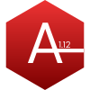

# Apollo 1.12


Apollo is an approachable and intuitive programming language designed for learners and seasoned developers alike. Drawing inspiration from Python, Apollo offers a gentle learning curve, making it an ideal starting point for those venturing into the world of coding. Its syntax, deliberately kept simple, encourages readability and minimizes unnecessary complexity. Within Apollo’s ecosystem, you’ll find a dedicated interactive shell—a playground where experimentation and exploration thrive. Whether you’re crafting a small script or building a larger project, Apollo’s concise expressions allow you to articulate ideas effortlessly. The language prioritizes clarity over cryptic constructs, emphasizing human-friendly code. As you delve into Apollo, you’ll notice familiar Python concepts seamlessly integrated, providing a comfortable transition. Whether you’re a curious beginner or a seasoned developer seeking a fresh perspective, Apollo invites you to create, iterate, and express your creativity. So, grab your metaphorical astronaut helmet, step into the Apollo universe, and embark on your coding journey—it’s time to reach for the stars! 🚀

#Installing and using apollo
# 1. download the git repo and cd into the dir
\```
 cd /apollo/file/dir/
\```
# 2. run the shell bia python
\```
 python shell.py
\```
# 3. run the tutorial
\```
 rwun("tutorial.apollo")
\```


